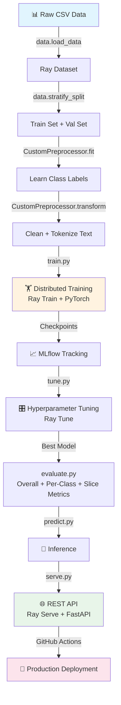

# 🚀 Made With ML — Complete Beginner's Learning Guide

---

## 🎯 Project Objective

### What does this project do?

This project builds an **AI-powered text classifier** that automatically categorizes machine learning projects into one of 4 categories:

| Category | Example Input |
|---|---|
| `natural-language-processing` | "BERT fine-tuning for sentiment analysis" |
| `computer-vision` | "Object detection using YOLO" |
| `mlops` | "Deploying ML models with Kubernetes" |
| `other` | "Reinforcement learning for game playing" |

**Input** → A project's **title** + **description** (plain text)
**Output** → The predicted **category** + confidence probabilities

### Real-World Analogy 🏷️

Imagine you're building a **smart librarian** 📚 — when someone donates a new book (ML project), the librarian reads the title and summary, then automatically places it on the correct shelf (category). That's exactly what this project does!

### The REAL goal — it's NOT just about the classifier

> [!IMPORTANT]
> The classification model is just the **vehicle**. The actual goal of this project is to teach you the **entire MLOps lifecycle** — how real companies build, test, deploy, and maintain ML systems in production.

```
  ┌─────────────────────────────────────────────────────────────────┐
  │                    WHAT YOU'LL ACTUALLY LEARN                    │
  │                                                                 │
  │   📊 Data          →  How to load, clean, split data at scale   │
  │   🧠 Model         →  Fine-tune a pretrained LLM (SciBERT)     │
  │   🏋️ Training      →  Distributed training across workers       │
  │   🎛️ Tuning        →  Automated hyperparameter optimization    │
  │   📈 Tracking      →  Log experiments with MLflow               │
  │   ✅ Testing       →  Test code, data quality, AND model perf   │
  │   🌐 Serving       →  Deploy as a REST API                      │
  │   🔄 CI/CD         →  Automate everything with GitHub Actions   │
  │   📦 Production    →  Go from laptop to cloud seamlessly        │
  └─────────────────────────────────────────────────────────────────┘
```

### How does the model work?

```
  "Transfer learning          ┌──────────────┐
   with transformers"    ──►  │              │
                              │   SciBERT    │  ──►  Dropout  ──►  Linear Layer  ──►  "NLP" ✓
  "Using transformers         │  (pretrained │                     (768 → 4)
   for text tasks"       ──►  │    model)    │
                              └──────────────┘
                               Understands           Prevents        Maps to          Final
                               scientific text        overfitting     4 categories     prediction
```

1. **Text input** → title + description are combined and cleaned
2. **SciBERT** → a pretrained language model (like ChatGPT's cousin, but for scientific text) converts text to numbers (embeddings)
3. **Classification head** → a simple neural network layer maps embeddings to one of 4 categories

---

## 📋 Prerequisites — What You Need Before Starting

Don't worry if you don't know everything — use the resources below to fill gaps as you go!

| Prerequisite | Level Needed | Quick Resource if Unfamiliar |
|---|---|---|
| **Python basics** | Variables, functions, classes, loops | [Python Tutorial](https://docs.python.org/3/tutorial/) |
| **Virtual environments** | Creating & activating venvs | [Python venv guide](https://docs.python.org/3/library/venv.html) |
| **Command line/Terminal** | Running commands, setting env vars | [Command Line Crash Course](https://developer.mozilla.org/en-US/docs/Learn/Tools_and_testing/Understanding_client-side_tools/Command_line) |
| **Git/GitHub basics** | Clone, commit, push, pull requests | [GitHub quickstart](https://docs.github.com/en/get-started/quickstart) |
| **PyTorch basics** | Tensors, nn.Module, training loop | [PyTorch 60-min blitz](https://pytorch.org/tutorials/beginner/deep_learning_60min_blitz.html) |
| **NLP basics** | What tokenization & embeddings mean | [HuggingFace NLP Course](https://huggingface.co/learn/nlp-course) — Ch 1 |
| **REST APIs** | GET/POST, JSON | [What is a REST API?](https://www.redhat.com/en/topics/api/what-is-a-rest-api) |

> [!TIP]
> You **don't** need to know Ray, MLflow, or Ray Serve beforehand — the project teaches these from scratch!

---

## 🗂️ Project Structure at a Glance

```
Made-With-ML-main/
│
├── 📓 notebooks/
│   └── madewithml.ipynb       ← START HERE! Interactive walkthrough
│
├── 🐍 madewithml/             ← Production code (clean scripts)
│   ├── config.py              ← Settings, paths, logging, stopwords
│   ├── data.py                ← Load, clean, tokenize, preprocess data
│   ├── models.py              ← FinetunedLLM model definition
│   ├── train.py               ← Distributed training pipeline
│   ├── tune.py                ← Hyperparameter search
│   ├── evaluate.py            ← Model evaluation + slice analysis
│   ├── predict.py             ← Run inference on new data
│   ├── serve.py               ← REST API for serving predictions
│   └── utils.py               ← Helper functions
│
├── 📊 datasets/
│   ├── dataset.csv            ← Main training data (~955 projects)
│   ├── holdout.csv            ← Held-out test data (~191 projects)
│   ├── projects.csv           ← Raw project data
│   └── tags.csv               ← Tag metadata
│
├── 🧪 tests/
│   ├── code/                  ← Unit tests for Python functions
│   ├── data/                  ← Data quality & schema tests
│   └── model/                 ← Behavioral testing of model predictions
│
├── 🚀 deploy/
│   ├── cluster_env.yaml       ← Cloud environment configuration
│   ├── cluster_compute.yaml   ← Cloud compute resources
│   ├── jobs/                  ← Training job definitions
│   └── services/              ← Serving deployment definitions
│
├── ⚙️ .github/workflows/     ← CI/CD automation
│   ├── workloads.yaml         ← Run training on PR
│   └── serve.yaml             ← Deploy model on merge
│
└── 📝 README.md               ← Project overview & setup instructions
```

---

## 📚 Step-by-Step Learning Path (Beginner-Friendly)

### Step 1 — Read the README & Watch the Overview Video
**⏰ Time: 30 minutes | 📁 File: [README.md](file:///Users/soubhik/AI/full-stack-ai-with-python/Scikit_ML/SelfLearn/madewithml/Made-With-ML-main/README.md)**

- Read the README top-to-bottom (you don't need to understand everything yet)
- Watch the [overview video](https://youtu.be/AWgkt8H8yVo) linked in the README
- Browse the [madewithml.com course page](https://madewithml.com/#course) — bookmark it

**✅ After Step 1 you know**: What the project builds and why each component exists

---

### Step 2 — Explore the Data
**⏰ Time: 30 minutes | 📁 File: [datasets/dataset.csv](file:///Users/soubhik/AI/full-stack-ai-with-python/Scikit_ML/SelfLearn/madewithml/Made-With-ML-main/datasets/dataset.csv)**

Open the CSV and look at the raw data:

```
id | created_on | title                              | description                        | tag
---|------------|------------------------------------|------------------------------------|----------------------------
1  | 2020-02-20 | Transfer learning with transformers | Using transformers for ...         | natural-language-processing
2  | 2020-02-20 | Object detection with YOLO          | Real-time object detection ...     | computer-vision
...
```

**Things to notice:**
- How many rows? How many unique `tag` values?
- What does the text look like? Short? Long? Mixed?
- This is a **multi-class classification** problem (1 correct answer per project)

**✅ After Step 2 you know**: What the input data looks like and what you're predicting

---

### Step 3 — Work Through the Jupyter Notebook ⭐ (MOST IMPORTANT STEP)
**⏰ Time: 2–3 days | 📁 File: [notebooks/madewithml.ipynb](file:///Users/soubhik/AI/full-stack-ai-with-python/Scikit_ML/SelfLearn/madewithml/Made-With-ML-main/notebooks/madewithml.ipynb)**

```bash
jupyter lab notebooks/madewithml.ipynb
```

This 325KB notebook is the **heart of the project**. It walks you through every ML workload interactively. Go cell-by-cell and:

| Notebook Section | What You'll Learn | Beginner Notes |
|---|---|---|
| **Data ingestion** | Loading CSVs into Ray Datasets | Ray Dataset = pandas DataFrame that scales |
| **EDA** | Class distributions, text lengths | Check: are classes balanced? |
| **Preprocessing** | Text cleaning (lowercase, remove stopwords, regex) | Look at before/after examples |
| **Tokenization** | Converting text → numbers using SciBERT tokenizer | Each word becomes an integer ID |
| **Splitting** | Stratified train/test split | "Stratified" = same % of each class in both splits |
| **Model** | `FinetunedLLM` = SciBERT + classification layer | Transfer learning: reuse a pretrained brain |
| **Training** | Training loop with Ray Train | Forward pass → loss → backward pass → update weights |
| **Evaluation** | Precision, recall, F1 per class | These measure "how good" the model is |
| **Tuning** | Hyperparameter search with Ray Tune | Automatically find the best dropout, learning rate, etc. |
| **Inference** | Making predictions | Feed in new text → get category |

> [!TIP]
> **For each cell**: (1) Read the markdown explanation, (2) Read the code, (3) Run the cell, (4) Check the output, (5) Try modifying something to see what happens.

**✅ After Step 3 you know**: How every piece of the ML pipeline works hands-on

---

### Step 4 — Learn the Config & Utilities
**⏰ Time: 1 hour | 📁 Files: [config.py](file:///Users/soubhik/AI/full-stack-ai-with-python/Scikit_ML/SelfLearn/madewithml/Made-With-ML-main/madewithml/config.py) → [utils.py](file:///Users/soubhik/AI/full-stack-ai-with-python/Scikit_ML/SelfLearn/madewithml/Made-With-ML-main/madewithml/utils.py)**

Now shift from notebook to **production scripts**. Start with the "plumbing":

**config.py** — Sets up everything the project needs:
| What | Why |
|---|---|
| `ROOT_DIR`, `LOGS_DIR`, `EFS_DIR` | Where things are stored on disk |
| `MODEL_REGISTRY`, `MLFLOW_TRACKING_URI` | Where MLflow saves experiments |
| `logging_config` | How logs are written (to console + files) |
| `STOPWORDS` | Words to remove during text cleaning ("the", "is", etc.) |

**utils.py** — Reusable helper functions:
| Function | What it does |
|---|---|
| `set_seeds()` | Makes results reproducible (same random numbers every time) |
| `load_dict()` / `save_dict()` | Read/write JSON files |
| `pad_array()` | Makes text sequences the same length (required for batch processing) |
| `collate_fn()` | Converts numpy arrays → PyTorch tensors for the model |
| `get_run_id()` | Finds MLflow run ID for a Ray training trial |

**✅ After Step 4 you know**: How production ML projects organize configuration and shared logic

---

### Step 5 — Understand the Data Pipeline
**⏰ Time: 2 hours | 📁 File: [data.py](file:///Users/soubhik/AI/full-stack-ai-with-python/Scikit_ML/SelfLearn/madewithml/Made-With-ML-main/madewithml/data.py)**

This is the same data logic from the notebook, but organized into clean functions:

```
CSV file  ──►  load_data()  ──►  stratify_split()  ──►  CustomPreprocessor
                  │                    │                        │
            Ray Dataset         train + test sets         fit() → learn class labels
                                                          transform() → clean + tokenize
```

**Key functions to study:**

| Function | Purpose | Beginner concept |
|---|---|---|
| `load_data()` | Reads CSV into Ray Dataset | Like `pd.read_csv()` but distributed |
| `stratify_split()` | Splits data keeping class ratios | If 40% NLP in full data → 40% NLP in train AND test |
| `clean_text()` | Lowercase, remove stopwords, strip special chars | "The BERT model!" → "bert model" |
| `tokenize()` | Text → token IDs using SciBERT | "bert model" → [2478, 1294, ...] |
| `CustomPreprocessor` | Wraps fit/transform pattern | Like sklearn's `LabelEncoder` but for the whole pipeline |

**✅ After Step 5 you know**: How raw text becomes model-ready numerical features

---

### Step 6 — Study the Model Architecture
**⏰ Time: 1 hour | 📁 File: [models.py](file:///Users/soubhik/AI/full-stack-ai-with-python/Scikit_ML/SelfLearn/madewithml/Made-With-ML-main/madewithml/models.py)**

This is a small but important file (just 60 lines):

```python
class FinetunedLLM(nn.Module):
    # SciBERT (pretrained) → Dropout → Linear(768, 4)
    
    def forward(batch):    # Feed text through model → get raw scores
    def predict(batch):    # forward + argmax → get predicted class index
    def predict_proba():   # forward + softmax → get probabilities per class
    def save(dp):          # Save model weights + config to disk
    def load(cls, ...):    # Load a saved model from disk
```

**Why SciBERT?** It's a BERT model pretrained on scientific papers — perfect for classifying ML projects!

**✅ After Step 6 you know**: How transfer learning works — take a pretrained model, add a simple head, fine-tune

---

### Step 7 — Training & Hyperparameter Tuning
**⏰ Time: 3 hours | 📁 Files: [train.py](file:///Users/soubhik/AI/full-stack-ai-with-python/Scikit_ML/SelfLearn/madewithml/Made-With-ML-main/madewithml/train.py) → [tune.py](file:///Users/soubhik/AI/full-stack-ai-with-python/Scikit_ML/SelfLearn/madewithml/Made-With-ML-main/madewithml/tune.py)**

**train.py** — The most complex file. Read it in this order:

| Section | Lines | What to understand |
|---|---|---|
| `train_step()` | 36–68 | Standard PyTorch: forward → loss → backward → step |
| `eval_step()` | 71–98 | Same as train_step but no gradients (just measuring) |
| `train_loop_per_worker()` | 101–148 | What EACH worker does (loads model, trains, checkpoints) |
| `train_model()` | 151–254 | Orchestrator: sets up data, trainer, launches distributed training |

**tune.py** — Builds on train.py, adds automatic hyperparameter search:

| Concept | What it means |
|---|---|
| `param_space` | Range of values to try (dropout: 0.3–0.9, lr: 1e-5 to 5e-4) |
| `HyperOptSearch` | Smart algorithm that picks promising combinations |
| `AsyncHyperBandScheduler` | Stops bad trials early to save time |
| `Tuner` | Runs multiple training trials with different hyperparameters |

**✅ After Step 7 you know**: How to do distributed training and automated hyperparameter optimization

---

### Step 8 — Evaluation & Prediction
**⏰ Time: 2 hours | 📁 Files: [evaluate.py](file:///Users/soubhik/AI/full-stack-ai-with-python/Scikit_ML/SelfLearn/madewithml/Made-With-ML-main/madewithml/evaluate.py) → [predict.py](file:///Users/soubhik/AI/full-stack-ai-with-python/Scikit_ML/SelfLearn/madewithml/Made-With-ML-main/madewithml/predict.py)**

**evaluate.py** — Goes beyond simple accuracy:

| Function | What it measures |
|---|---|
| `get_overall_metrics()` | Weighted precision, recall, F1 across ALL classes |
| `get_per_class_metrics()` | Same metrics but for EACH class separately |
| `get_slice_metrics()` | Performance on specific **slices** (e.g., short text, NLP+LLM projects) |

> [!NOTE]
> **Slice-based evaluation** is a production best practice. Overall F1 = 0.90 might hide that you're terrible at short text inputs. Slicing reveals these blind spots.

**predict.py** — Making predictions with a trained model:

| Component | Role |
|---|---|
| `TorchPredictor` | Wraps model + preprocessor for easy inference |
| `get_best_checkpoint()` | Finds the best saved model from MLflow |
| `predict_proba()` | Returns prediction + probability for each class |
| `decode()` / `format_prob()` | Convert indices back to readable labels |

**✅ After Step 8 you know**: How to properly evaluate ML models and make predictions

---

### Step 9 — Serving as an API
**⏰ Time: 1.5 hours | 📁 File: [serve.py](file:///Users/soubhik/AI/full-stack-ai-with-python/Scikit_ML/SelfLearn/madewithml/Made-With-ML-main/madewithml/serve.py)**

This is where your model becomes a **web service** anyone can use:

```
Client sends POST request:
{
  "title": "Transfer learning with transformers",        ┌────────────────┐
  "description": "Using transformers for text tasks"  ──►│  Ray Serve +   │──► {"prediction": "NLP",
}                                                        │   FastAPI      │    "probabilities": {...}}
                                                         └────────────────┘
```

**Key endpoints:**
| Endpoint | Method | Purpose |
|---|---|---|
| `/` | GET | Health check — "is the server alive?" |
| `/run_id/` | GET | Which model version is running |
| `/predict/` | POST | Send text, get prediction back |
| `/evaluate/` | POST | Evaluate model on a dataset |

**Interesting detail**: There's a `threshold` parameter — if the model isn't confident enough (< 90%), it returns `"other"` instead of guessing.

**✅ After Step 9 you know**: How to deploy an ML model as a REST API

---

### Step 10 — Testing, CI/CD & Production
**⏰ Time: 2 hours | 📁 Multiple files**

#### 10a — Testing (3 levels!)

| Test Type | Directory | What it tests | Example |
|---|---|---|---|
| **Code tests** | [tests/code/](file:///Users/soubhik/AI/full-stack-ai-with-python/Scikit_ML/SelfLearn/madewithml/Made-With-ML-main/tests/code) | Functions work correctly | `clean_text("Hello WORLD") == "hello world"` |
| **Data tests** | [tests/data/](file:///Users/soubhik/AI/full-stack-ai-with-python/Scikit_ML/SelfLearn/madewithml/Made-With-ML-main/tests/data) | Data quality is good | All expected columns exist, no nulls |
| **Model tests** | [tests/model/](file:///Users/soubhik/AI/full-stack-ai-with-python/Scikit_ML/SelfLearn/madewithml/Made-With-ML-main/tests/model) | Model behavior is correct | "BERT for NLP" should predict NLP, not CV |

#### 10b — CI/CD Workflows

| Workflow | Trigger | What it does |
|---|---|---|
| [workloads.yaml](file:///Users/soubhik/AI/full-stack-ai-with-python/Scikit_ML/SelfLearn/madewithml/Made-With-ML-main/.github/workflows/workloads.yaml) | Pull Request opened | Runs tests → trains model → evaluates → posts results on PR |
| [serve.yaml](file:///Users/soubhik/AI/full-stack-ai-with-python/Scikit_ML/SelfLearn/madewithml/Made-With-ML-main/.github/workflows/serve.yaml) | PR merged to `main` | Deploys the model to production |

#### 10c — Production workflow
Study [deploy/jobs/workloads.sh](file:///Users/soubhik/AI/full-stack-ai-with-python/Scikit_ML/SelfLearn/madewithml/Made-With-ML-main/deploy/jobs/workloads.sh) — it shows the full **automated pipeline**:

```
Test Data → Test Code → Train → Get Best Model → Evaluate → Test Model → Upload to S3
```

**✅ After Step 10 you know**: How real companies automate ML from code push to production

---

## 🗓️ Suggested Schedule

| Day | What to Do | Step |
|---|---|---|
| **Day 1** | Read README, watch video, explore data | Steps 1–2 |
| **Day 2–4** | Work through the Jupyter notebook (most important!) | Step 3 |
| **Day 5** | Read config.py, utils.py, data.py | Steps 4–5 |
| **Day 6** | Study models.py, run training locally | Steps 6–7 |
| **Day 7** | Read train.py in depth, try modifying hyperparams | Step 7 |
| **Day 8** | Study tune.py, evaluate.py, predict.py | Steps 7–8 |
| **Day 9** | Study serve.py, try running the API locally | Step 9 |
| **Day 10** | Read tests, CI/CD workflows, deployment configs | Step 10 |

---

## 🔁 Complete Data Flow (End-to-End)



---

## 💡 Tips for Success

> [!TIP]
> 1. **Don't skip the notebook** — it's where you build intuition
> 2. **Read the course website** alongside code — [madewithml.com](https://madewithml.com/#course) has detailed theory explanations
> 3. **Compare notebook ↔ scripts** — notice how the same logic becomes production-grade
> 4. **Run things locally** — even if training is slow, the experience is invaluable
> 5. **Break things on purpose** — change a hyperparameter, remove a preprocessing step, see what happens
> 6. **Don't try to learn everything at once** — one step per day is a great pace
> 7. **When stuck on Ray**: think of it as "pandas/PyTorch but it can use multiple machines"

> [!WARNING]
> The project uses Ray, which can be version-sensitive. If you hit errors, make sure you're using **Python 3.10** and the exact library versions from the requirements file.

---

> **TL;DR**: Open `notebooks/madewithml.ipynb` → run it cell-by-cell → then read the production scripts in the order listed above. Everything else builds on the notebook foundation. 🎓
