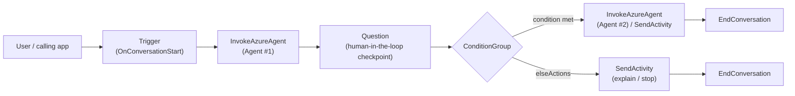
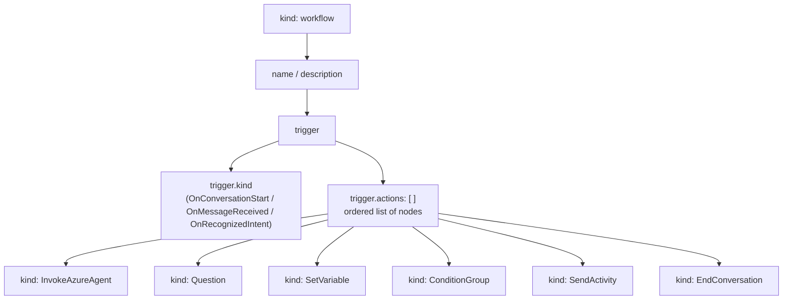
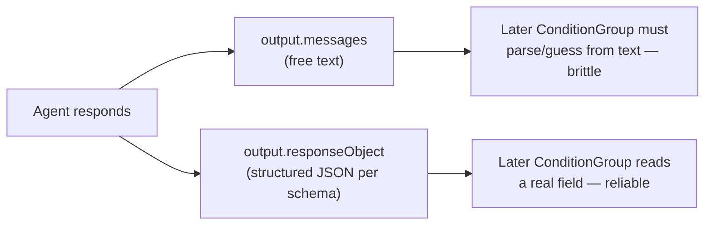
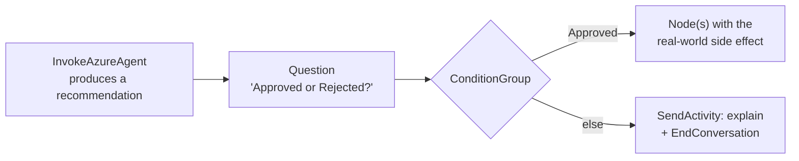

# Azure AI Foundry Agent Service — Workflows (Declarative Orchestration)

> Companion concept notes for [`13_workflow_template.yml`](13_workflow_template.yml) (a
> standard, copy-and-adapt template covering every node kind) and the worked example at
> [`../08_document_intelligence_capstone/06_workflow.yml`](../08_document_intelligence_capstone/06_workflow.yml)
> (a real human-in-the-loop invoice-approval workflow). This note explains *what a Foundry
> workflow is*, *why it exists next to a plain agent call*, and *how the AI-103 exam expects you
> to reason about it* — see EXAM_NOTES.md Section 9 for the condensed version of the same
> material.

## 1. What is a Foundry workflow?

A single Foundry **agent** answers one request at a time: you send a message, the agent (model +
instructions + tools) replies. A **workflow** is the layer above that — a declarative,
node-based control-flow definition that decides *which* agent(s) to call, in *what order*, with
*what input*, and *what happens with the output*. It is authored visually in the Foundry
workflow designer and can be exported/edited as YAML — the same schema shown in both files
referenced above.

## 2. Why not just call the agent directly?

A raw agent call is enough for "ask a question, get an answer." A workflow earns its keep the
moment a scenario needs any of the following — and the exam tests recognizing *which* of these
signals point at "workflow":

| Requirement | Why a workflow, not ad-hoc code |
|---|---|
| **Deterministic step order** | The workflow graph *is* the order — no custom control flow to write or maintain |
| **Conditional branching** on a prior step's result | `ConditionGroup` routes declaratively on a Power Fx expression |
| **Shared state** across multiple agent calls | `Local.*` variables persist for the life of the run and are visible to every later node |
| **Human-in-the-loop checkpoints** | `Question` pauses the run and waits for a reply — approve/reject, pick an option, confirm a detail |
| **Routing between several specialized agents** | Each step is its own `InvokeAzureAgent` node; a triage agent's structured output can pick which agent runs next |

**💡 Exam tip:** a scenario describing "three specialized agents run in a deterministic
sequence with conditional branching, shared state, minimal custom code" → the answer is **a
Foundry workflow**. Distractors to rule out: *threads/runs coordinated manually in application
code* (pushes all the orchestration into your own code — the opposite of "minimal custom code"),
and *free-form multi-agent group chat* (built for open-ended conversation between agents, not a
controlled, auditable pipeline).

## 3. Anatomy of a workflow file

Every workflow file has exactly one `kind: workflow` document with a `name`, `description`,
and a `trigger`. The trigger's `actions:` list is the workflow body — an ordered sequence of
**nodes**, each with a `kind` (its type) and a unique `id`. `ConditionGroup` nodes nest their own
`actions`/`elseActions` lists, so the overall shape is a tree/DAG, not a flat list.

## 4. The node kinds

| Node kind | Role | Key fields |
|---|---|---|
| **InvokeAzureAgent** | Calls a published Foundry agent — the only node that does "AI work" | `agent.name`, `input.messages`, `output.messages` / `output.responseObject`, `output.autoSend` |
| **Question** | Pauses the run and asks the user (or a human reviewer) for input — the human-in-the-loop primitive | `variable`, `entity`, `prompt` |
| **SetVariable** | Assigns/computes a value with a Power Fx expression, no agent or user involved | `variable`, `value` |
| **ConditionGroup** | Branches the workflow on a Power Fx boolean expression | `conditions[].condition`, `conditions[].actions`, `elseActions` |
| **SendActivity** | Sends a message to the user without invoking an agent (status/confirmation text) | `activity` |
| **EndConversation** | Terminates the run — every branch needs one | *(no extra fields)* |

**Trigger kinds:**

| Trigger kind | Fires when |
|---|---|
| `OnConversationStart` | A new conversation/thread begins with the workflow — the most common case |
| `OnMessageReceived` | Any inbound user message arrives in an already-open conversation |
| `OnRecognizedIntent` | A connected recognizer/router matches a specific intent to this workflow (fan-out from one triage front door to several specialist workflows) |

## 5. Structured output: `responseObject` vs. free-text `messages`

An `InvokeAzureAgent` node can capture the called agent's reply two ways:

If a later `ConditionGroup` needs to branch on what the agent decided (e.g. an intake-triage
agent choosing "knowledge question" vs. "needs a ticket"), configure the agent to return
**structured output** and capture it with `output.responseObject` instead of parsing sentences
out of `output.messages`. **💡 Exam tip:** "capture agent output as structured data
(`responseObject`) to route on it" is a recurring phrasing on AI-103 for exactly this pattern —
e.g. intake-triage routing to a knowledge agent vs. a ticket-writing agent.

## 6. Power Fx basics you need for `condition` / `value` / interpolation

Workflow expressions use **Power Fx**, the same formula language behind Power Apps/Copilot
Studio. Three things show up constantly in workflow YAML:

- **`=` prefix** marks a field as a Power Fx expression rather than a literal string, e.g.
  `condition: =Upper(Trim(Local.Answer)) = "APPROVED"`.
- **`{...}` interpolation** embeds an expression's value inside a text block (a `prompt` or
  `activity`), e.g. `activity: "Status: {Upper(Local.Answer)}"`.
- **Variable scopes** — `Local.<name>` (this run only; the default for anything a node
  captures), `System.<name>` (built-in runtime values like `System.ConversationId`, read-only),
  `Global.<name>` (shared beyond a single run — used sparingly).

**💡 Exam tip (frequently mis-guessed):** "only proceed if the user actually answered" is
`Not(IsBlank(Local.MyVar))` — **not** `IsBlank(...)` (that condition is *inverted*, true when the
field is empty) and **not** `IsEmpty(...)` (that targets tables/collections, not a scalar text
variable).

## 7. Human-in-the-loop and safeguards

Any workflow step with a **real-world, hard-to-reverse side effect** — approving a refund,
sending an email, closing a ticket, releasing a payment — should sit behind a `Question` node
that requires explicit human approval before the workflow continues, exactly like the
`ApprovalStatus` gate in `../08_document_intelligence_capstone/06_workflow.yml`. This is the
"safeguard" Microsoft's guidance calls for on **autonomous or semi-autonomous** workflows:
approval flow controls, constraints, and monitoring hooks, plus evaluating agent behavior and
performing error analysis on traces after the fact.

## 8. Recap

| Concept | One-line takeaway |
|---|---|
| Workflow vs. agent call | Workflow = control flow *around* one or more agent calls, not the agent itself |
| When to use one | Deterministic order, branching, shared state, human checkpoints, multi-agent routing |
| Trigger | `OnConversationStart` (most common) · `OnMessageReceived` · `OnRecognizedIntent` |
| Core nodes | `InvokeAzureAgent` · `Question` · `SetVariable` · `ConditionGroup` · `SendActivity` · `EndConversation` |
| Branch on agent output | Prefer `responseObject` (structured) over parsing `messages` (free text) |
| Expression language | Power Fx — `=` prefix, `{...}` interpolation, `Local.` / `System.` / `Global.` scopes |
| Risky actions | Gate behind a `Question` approval node — the workflow-level safeguard pattern |

---

← Back to [`02_foundry_agent_service/`](.) · [Chapter 14 README](../README.md)
