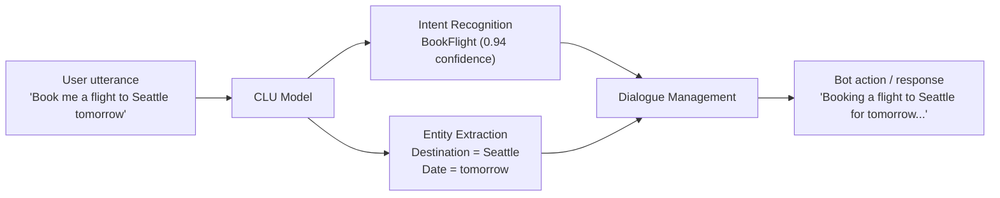
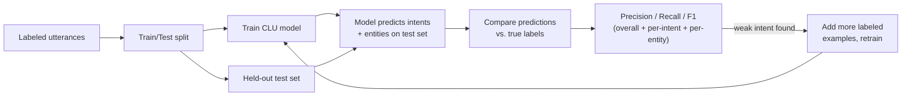
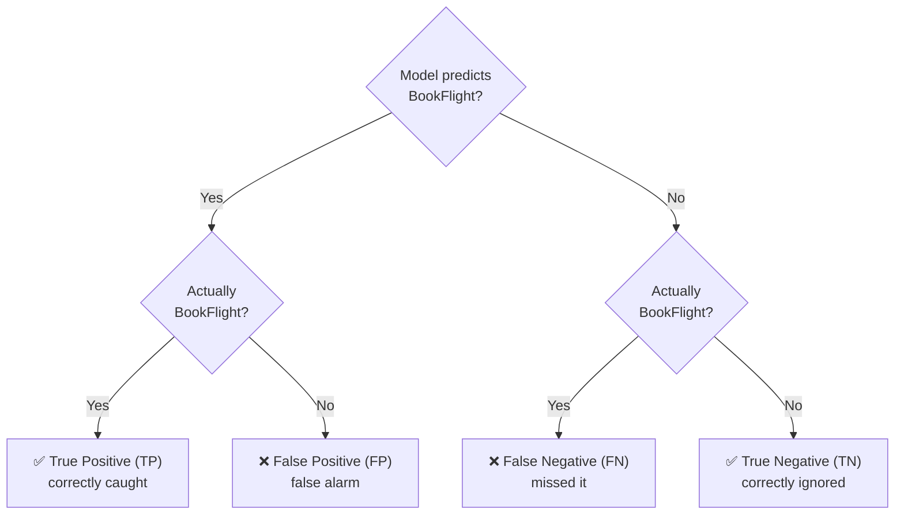
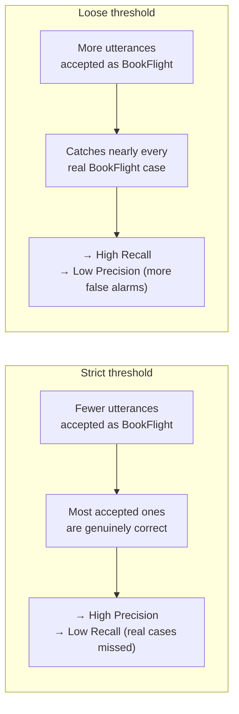
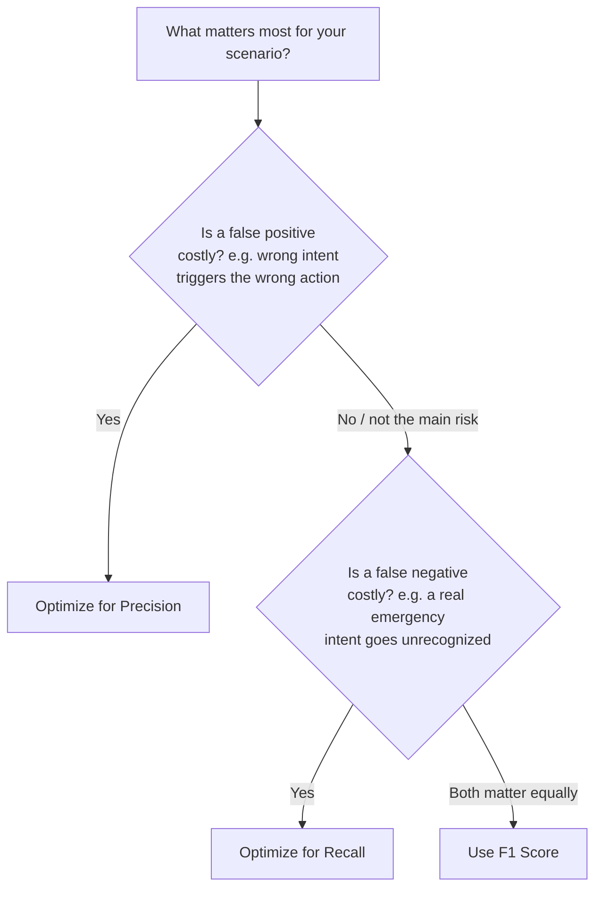

# Conversational Language Understanding (CLU) — Evaluating Model Accuracy

> Companion concept notes for this folder's Azure AI Language scripts (intent/entity-style
> tasks like [`07_azure_language_ner.py`](07_azure_language_ner.py) and
> [`05_azure_language_pii.py`](05_azure_language_pii.py)). CLU itself is the *custom intent +
> entity* project type inside **Azure AI Language Studio** — this note explains what it is and,
> more importantly, how Microsoft (and the AI-103/AI-102 exam) expects you to judge whether a
> trained CLU model is actually good.

## 1. What is Conversational Language Understanding (CLU)?

CLU is an Azure AI Language feature for turning a raw user utterance ("book me a flight to
Seattle tomorrow") into something an application can act on: **which intent** the user meant, and
**which entities** (slots) were mentioned. It's the successor to the older LUIS service and is the
NLU layer behind chatbots, virtual assistants, and IVR systems.

Three moving parts, all trained together in one CLU project:

| Task | Question it answers | Example output |
|---|---|---|
| **Intent recognition** | What does the user *want*? | `BookFlight`, `CancelOrder`, `CheckWeather`, `None` |
| **Entity extraction** | What are the *specifics*? | `Destination = Seattle`, `Date = tomorrow` |
| **Dialogue management** | What happens *next*? | Fill a slot, call an API, ask a follow-up question |

## 2. Why evaluate model accuracy?

A CLU model is only useful if it's *reliably* right. Training a model without measuring it is like
shipping code without tests — it might work, but you have no evidence and no way to compare
"version 2" against "version 1" before it reaches users. Azure AI Language Studio evaluates every
CLU model automatically after training, using a held-out test split, and reports **Precision**,
**Recall**, and **F1 score** — both for the model overall and broken down per intent and per
entity, so you can see exactly which intent is weak instead of only a single aggregate number.

## 3. The foundation: the confusion matrix

Every one of these metrics is built from four counts, for a given intent (e.g. "is this utterance
`BookFlight` or not?"):

- **TP** — model said `BookFlight`, and it was.
- **FP** — model said `BookFlight`, but it wasn't (a *false alarm*).
- **FN** — model said something else, but it actually was `BookFlight` (a *miss*).
- **TN** — model correctly said "not `BookFlight`".

Precision, Recall, and F1 are just different ratios of these four numbers.

## 4. Precision

**Definition:** Of everything the model *predicted* as positive, how much was actually correct?
It measures the trustworthiness of a positive prediction.

$$\text{Precision} = \frac{TP}{TP + FP}$$

**Use it when false positives are the expensive mistake** — e.g. spam detection (don't block real
email), fraud alerts (don't freeze a legitimate transaction), or a CLU intent that triggers an
irreversible action (don't let a misheard "cancel" trigger `CancelOrder`).

**Worked example:** the model flags 100 utterances as `BookFlight`. 80 of them truly are.

$$\text{Precision} = \frac{80}{80 + 20} = 80\%$$

## 5. Recall

**Definition:** Of everything that *actually was* positive, how much did the model catch? It
measures completeness — how few real cases slip through.

$$\text{Recall} = \frac{TP}{TP + FN}$$

**Use it when false negatives are the expensive mistake** — e.g. disease diagnosis (don't miss a
sick patient), emergency/safety intents (don't fail to recognize "I need help now"), or fraud
detection where missing a real case is worse than a false alarm.

**Worked example:** there are 100 utterances that are truly `BookFlight`. The model correctly
identifies 80 of them (missing 20).

$$\text{Recall} = \frac{80}{80 + 20} = 80\%$$

## 6. F1 Score — balancing both

**Definition:** the harmonic mean of Precision and Recall. It punishes imbalance — a model can't
game F1 by being great at one metric and terrible at the other, the way an arithmetic mean would
let it.

$$\text{F1} = 2 \times \frac{\text{Precision} \times \text{Recall}}{\text{Precision} + \text{Recall}}$$

**Use it when Precision and Recall matter equally** — e.g. general-purpose information retrieval,
or as the single number to watch when comparing two CLU model iterations without favoring one
failure mode over the other. This is why **Azure AI Language Studio reports F1 as the headline
number** for each CLU model.

## 7. The Precision ↔ Recall tradeoff

Tightening or loosening a model's confidence threshold trades one metric for the other — this is
the core intuition the exam expects you to have:

F1 is the metric that finds the sweet spot between these two extremes.

## 8. Which metric should you use? (decision guide)

## 9. Worked end-to-end example (a CLU intent)

| | Predicted `BookFlight` | Predicted *other* |
|---|---|---|
| **Actually `BookFlight`** | TP = 80 | FN = 20 |
| **Actually *other***      | FP = 20 | TN = many |

$$\text{Precision} = \frac{80}{80+20} = 0.80 \qquad \text{Recall} = \frac{80}{80+20} = 0.80$$

$$\text{F1} = 2 \times \frac{0.80 \times 0.80}{0.80 + 0.80} = 0.80$$

In Language Studio's **Evaluation** tab, this same table shows up per intent and per entity, plus
a full confusion matrix across all intents — so a low F1 on one specific intent tells you exactly
which intent needs more labeled training utterances, without hurting the others.

## 10. Why not BLEU here?

**BLEU (Bilingual Evaluation Understudy)** scores *machine translation* quality by comparing a
generated translation against one or more human reference translations (n-gram overlap). It
belongs with [`04_text_translation.py`](04_text_translation.py) /
[`09_text_translation.py`](09_text_translation.py) in this same folder — **not** with CLU.

The giveaway on an exam question: BLEU answers *"how close is this generated sentence to a
reference sentence?"*, while Precision/Recall/F1 answer *"how correct/complete were this
classifier's predictions?"*. CLU is a classification problem (intent/entity labels), not a
text-generation problem, so BLEU never applies to it.

## 11. Recap

| Metric | Formula | Minimizes | Use when | CLU example |
|---|---|---|---|---|
| **Precision** | TP / (TP + FP) | False positives | Wrong action from a false alarm is costly | Don't let noise trigger `CancelOrder` |
| **Recall** | TP / (TP + FN) | False negatives | Missing a real case is costly | Never miss an emergency/urgent intent |
| **F1** | 2·P·R / (P + R) | Imbalance between P and R | Both matter equally | Headline metric Language Studio reports per model |
| **BLEU** | n-gram overlap vs. reference | — | Machine translation quality | Not applicable to CLU |

**💡 Exam tip (AI-103 / AI-102):** if a question describes "accuracy of *positive* predictions" →
**Precision**. If it describes "did the model *find all* the real cases" → **Recall**. If it says
"balance both equally" or gives a single number Language Studio reports for a CLU model → **F1**.
If translation/generation quality is mentioned → **BLEU**, and it's a distractor for any CLU
classification question.

---

← Back to [`06_language_and_speech/`](.) · [Chapter 14 README](../README.md)
