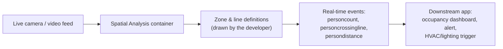
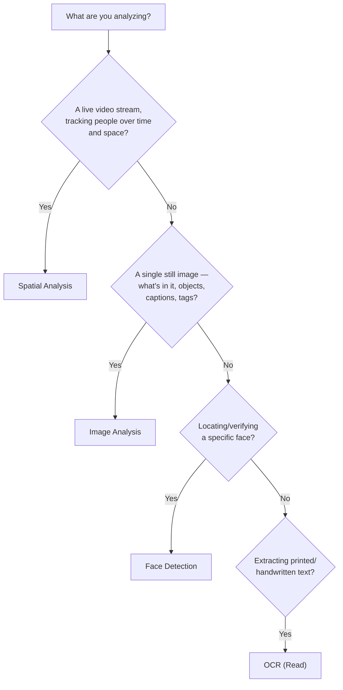

# Azure AI Vision — Choosing the Right Capability: Spatial Analysis vs. Face Detection vs. Image Analysis vs. OCR

> Companion concept notes for this folder's [`02_image_analysis.py`](02_image_analysis.py). This is
> a classic "pick the right Azure AI Vision service for this scenario" exam question. It's worth
> knowing cold — but read the **AI-103 currency note** at the bottom before assuming it still maps
> 1:1 onto the service you'd reach for on a real Azure AI Foundry project today.

## The question this note answers

*"You need a service that detects and tracks human presence, movement, and interactions from a
live video feed (e.g. counting people in a zone, detecting when someone enters a restricted area).
Which Azure AI Vision capability should you use?"* → **Spatial Analysis.**

## 1. Why Spatial Analysis is correct

**Purpose:** Spatial Analysis processes **real-time video** to detect human presence, movement,
and interactions *in physical space* — not just "is a person in this frame" but "how many people
are in this zone, did someone cross this line, how long did they dwell here."

**Key capabilities:**
- Detects and tracks human movement within a scene over time (not a single still frame).
- Identifies occupancy — how many people are in a defined zone right now.
- Analyzes behavior patterns — e.g. did anyone cross a line, linger, or breach a distance rule.
- Runs on a **live, continuous video stream**, not a one-shot image call.

**Common use cases:**

| Scenario | What Spatial Analysis does |
|---|---|
| Security surveillance | Alerts when someone enters a restricted zone |
| Smart buildings | Adjusts lighting/HVAC based on how many people are in a room |
| Retail analytics | Counts foot traffic, measures engagement time at a display |

## 2. Why the other three are wrong for this scenario

### A) Face Detection — wrong, because it's about *identity*, not *presence over space*
- **Purpose:** locate and analyze faces within an image or video frame.
- **Why it fails here:** it can tell you *a* face is present, but not track overall human movement
  or occupancy across a scene — it has no concept of zones, lines, or dwell time.
- **Where it's actually right:** identity verification, access control ("is this the badge
  holder?").

### B) Image Analysis — wrong, because it's for *static images*, not a *continuous stream*
- **Purpose:** understand the content of a single image — objects, tags, captions, scene
  description (this is exactly what [`02_image_analysis.py`](02_image_analysis.py) in this folder
  calls via `prebuilt-imageSearch`).
- **Why it fails here:** it analyzes one frame at a time with no built-in notion of tracking the
  same person across frames or measuring time-in-zone.
- **Where it's actually right:** "what's in this photo?" — tagging, captioning, moderation input.

### C) OCR (Optical Character Recognition) — wrong, because it reads *text*, not *people*
- **Purpose:** extract printed or handwritten text from images or video frames (signs, documents,
  license plates).
- **Why it fails here:** it has no human-detection or tracking capability at all.
- **Where it's actually right:** digitizing documents, reading a license plate or form field.

## 3. Recap table

| Capability | Input | Answers | Not suited for |
|---|---|---|---|
| **Spatial Analysis** | Live video stream | "How many people, where, for how long?" | Reading text, verifying identity |
| **Face Detection** | Image / video frame | "Is there a face here, and whose?" | Tracking crowds or zones over time |
| **Image Analysis** | Static image | "What objects/scene/caption describe this photo?" | Live tracking, text extraction |
| **OCR (Read)** | Image / video frame | "What text is written here?" | Detecting or tracking people |

**💡 Exam tip:** the fastest discriminator is **"video stream + human movement/occupancy over
time"** → Spatial Analysis. Swap "video stream" for "single photo" → Image Analysis. Swap "human
movement" for "whose face is this" → Face Detection. Swap the whole question to "extract the text"
→ OCR.

## 4. AI-103 currency note — read this before relying on the answer above

This repo's own [AI-103 exam notes](../EXAM_NOTES.md) flag that **Spatial Analysis, the standalone
Face API, Custom Vision, and Video Indexer are no longer in the current AI-103 outline** (see
`EXAM_NOTES.md` §12, "Study-budget alert" and the Legacy table). On the *current* exam, video and
scene understanding — including the kind of "who/what/where in this footage" analysis Spatial
Analysis used to own — has been folded into **Azure AI Content Understanding's video analyzers**,
which is what [`02_image_analysis.py`](02_image_analysis.py) and
[`01_invoice_analysis.py`](01_invoice_analysis.py) in this folder use for the modern approach.

So: know the Spatial Analysis / Face Detection / Image Analysis / OCR distinction above — it's
real product knowledge and still shows up in question banks written for the older AI-102 — but if
you're designing a *new* solution on Foundry today, or answering a fresh AI-103-blueprint question
about live video understanding, the expected answer is **Content Understanding**, not a standalone
Spatial Analysis container.

---

← Back to [`07_content_understanding/`](.) · [Chapter 14 README](../README.md) · [AI-103 Exam Notes](../EXAM_NOTES.md)
