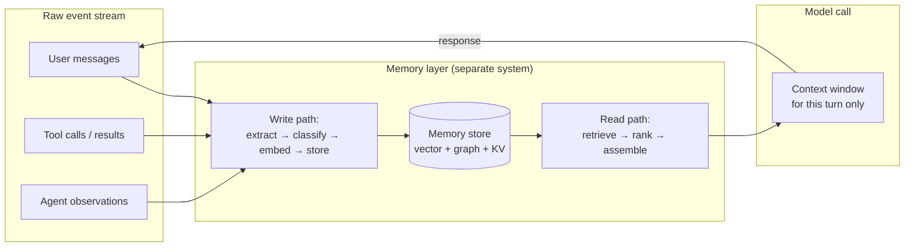
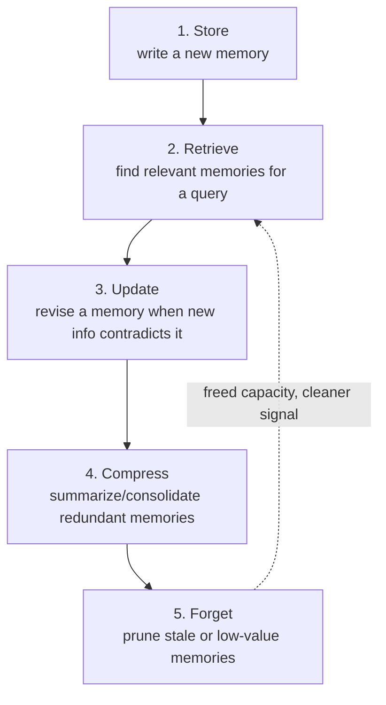

# The 2026 Landscape: Why Memory Became a First-Class Layer

## From "longer prompt" to "separate system"

Through 2023–2024, "memory" for most LLM apps meant one of two things: cram the whole
conversation back into the prompt, or bolt a RAG pipeline (see [`07_rag/`](../../07_rag/)) onto a
static document corpus. Neither is memory in the sense this chapter means. By 2026, the field
treats memory as its own architectural layer, sitting between the raw event stream (every message,
tool call, and observation an agent produces) and the context window the model actually sees for a
given turn.

This is the same write-path/read-path split taught for retrieval in
[`15_hippocampus_ai/00_concepts/`](../../15_hippocampus_ai/00_concepts/README.md)'s
`remember()`/`recall()` model — the 2026 consensus is that this split is the *general* pattern for
agent memory, not one library's design choice.

## Context rot: why bigger context windows didn't make memory unnecessary

Frontier context windows grew past 1M tokens by 2025, and the naive assumption was that memory
becomes unnecessary once you can just keep everything in-context. Production experience says
otherwise:

- **Lost in the middle** — information buried mid-context gets attended to less reliably than
  information near the start or end, regardless of window size.
- **Cost scales linearly** — every token in context is paid for and re-processed on every turn,
  whether or not it's relevant to the current task.
- **Accuracy degrades, not just latency** — long-horizon agents accumulate errors, stale facts,
  and contradicting statements the longer a raw transcript grows; researchers call the resulting
  degradation **context rot**.
- **Retrieval isn't automatically memory** — a RAG pipeline over raw transcript chunks still
  suffers "context collapse": a chunk gets retrieved on a semantic-similarity match, but the
  surrounding context that made it *true* (when, for whom, under what condition) gets stripped
  away, so a stale or conditional fact competes as if it were still current.

The industry's answer: keep the context window small and precise per turn, and make a dedicated
memory layer responsible for deciding what's still true and worth surfacing — compression and
selection happen *before* the context window, not by hoping the model ignores irrelevant tokens.

## The five universal memory operations

Regardless of which architecture a system uses (see [`02_architectures/`](../02_architectures/README.md)),
2026 survey literature converges on the same five operations every memory system has to implement:

| Operation | What it does | Failure mode if skipped |
|---|---|---|
| **Store** | Extract and classify what's worth remembering from raw events | Storing everything → noisy, unbounded, expensive recall |
| **Retrieve** | Find the memories relevant to the current task | Irrelevant or stale memories flood the context |
| **Update** | Revise a memory when new information contradicts an old one | Agent holds and acts on outdated facts ("You are going to Singapore in July" months after the trip) |
| **Compress** | Merge/summarize related memories into a durable form | Memory store grows unbounded; retrieval gets slower and noisier over time |
| **Forget** | Prune memories that are stale, low-importance, or unused | Old, wrong, or irrelevant memories keep surfacing and drowning out current ones |

`15_hippocampus_ai/`'s **sleep-phase consolidation** (see
[`00_concepts/README.md#5-consolidation--the-sleep-phase`](../../15_hippocampus_ai/00_concepts/README.md))
is one concrete implementation of operations 3–5 combined into a single nightly job.

## Production reality vs. benchmark reality

A recurring theme in 2026 reporting: vendor benchmark numbers and production numbers diverge
sharply. One widely cited data point from independent production testing: a memory system tested
at 50,000 real sessions returned only ~49% effective accuracy after 30 days, once stale data and
entity contradictions were accounted for — versus 90%+ scores the same class of system posts on
benchmark suites like LoCoMo and LongMemEval (see
[`03_frameworks_comparison/`](../03_frameworks_comparison/README.md) for benchmark numbers). The
gap is mostly the **update** and **forget** operations: benchmarks mostly test whether a fact can
be retrieved at all, not whether the memory layer correctly detects that a fact changed or expired.
Practical implication: don't select a memory framework off a benchmark leaderboard alone — run an
eval against your own workload, specifically probing knowledge-update and contradiction cases.

## Sources

- [The State of AI Agent Memory in 2026: What the Research Actually Shows](https://dev.to/vektor_memory_43f51a32376/the-state-of-ai-agent-memory-in-2026-what-the-research-actually-shows-3aja)
- [AI Agent Memory Frameworks in 2026: Memory vs. Context — Graphlit](https://www.graphlit.com/blog/survey-of-ai-agent-memory-frameworks)
- [AI Agent Memory 2026: Progress Benchmark Report Evaluations — Mem0](https://mem0.ai/blog/state-of-ai-agent-memory-2026)
- [Context rot explained (& how to prevent it) — Redis](https://redis.io/blog/context-rot/)
- [Memory vs Context Window for LLM and AI Agents — Mem0](https://mem0.ai/blog/context-window-is-ram-not-storage-why-most-agent-failures-happen-how-to-fix-them-in-2026)
- [RaMem: Contextual Reinstatement for Long-term Agentic Memory (arXiv 2606.22844)](https://arxiv.org/pdf/2606.22844)
- [AI Agent Memory: The 2026 Landscape — Mnemoverse Docs](https://mnemoverse.com/docs/research/ai-memory-landscape-2026)
