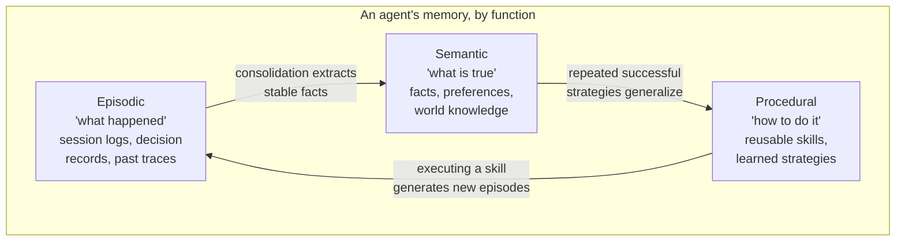

# The Memory Taxonomy: Episodic, Semantic, Procedural

Over 2025–2026 the agent-memory research field converged on a three-tier taxonomy borrowed
directly from cognitive science, most visibly formalized in the survey *"Memory in the Age of AI
Agents"* (Hu et al., a ~107-page unifying survey published late 2025) via a "forms–functions–
dynamics" framework: what shape a memory takes (architectural form), what it's used for
(functional role), and how it changes over time (lifecycle dynamics — the five operations from
[`00_landscape/`](../00_landscape/README.md)).

## The three functional types

| Type | Cognitive-science analogue | Agent-system example | Where you've already seen this in this repo |
|---|---|---|---|
| **Episodic** | "I remember going hiking last weekend" | A session transcript, a tool-call log, a `Memory(type="event")` record | `15_hippocampus_ai/01_core_client/02_conversation_extraction.py` extracting per-turn events |
| **Semantic** | "Paris is the capital of France" / "I prefer oat milk" | A stored fact/preference, a knowledge-graph triple | `15_hippocampus_ai/01_core_client/01_basic_remember_recall.py`'s `fact`/`preference` memory types |
| **Procedural** | Riding a bike — knowledge you execute, not recite | A learned prompt template, a cached successful tool-call sequence, a self-optimizing system prompt | HippocampAI's (beta) *procedural memory* feature — self-optimizing prompts from learned behavioral rules |

The key architectural insight driving 2026 designs: these three types have **different decay
rates and different storage shapes**, so treating them uniformly (one flat store, one embedding
index, one TTL) is what causes the retrieval noise described in
[`00_landscape/`](../00_landscape/README.md). Episodic memory should decay fast (yesterday's
specific event usually stops mattering); semantic memory about a stable preference should decay
slowly; procedural memory (a working strategy) should barely decay until proven wrong. This is
exactly the differentiated **half-life** design in
[`15_hippocampus_ai/00_concepts/README.md#2-memory-types`](../../15_hippocampus_ai/00_concepts/README.md) —
14-day half-life for events, 90-day for preferences/habits, 180-day for procedural rules.

## Working memory: the fourth, implicit tier

Most 2026 taxonomies also carry over cognitive science's **working memory** — the small,
always-visible scratchpad the model reasons with *right now* — but treat it as a property of the
context window itself, not the persistent store. In OS-inspired architectures (see
[`02_architectures/`](../02_architectures/README.md)) this is made explicit: Letta's "core memory"
is working memory that is always in-context, distinct from the "archival" and "recall" memory
tiers that live outside it and are pulled in on demand.

## Why this taxonomy, and not something else

Two things pushed the field toward this specific three-way split rather than staying with a single
undifferentiated memory store:

1. **Retrieval precision** — a query like "what should I say to this customer right now"
   needs semantic memory (who they are, their preferences) and episodic memory (what happened
   last time), but *not* procedural memory (how the support macro works internally). Splitting
   the store lets retrieval target the right tier instead of ranking apples against oranges in one
   embedding space.
2. **Independent lifecycle management** — the update/forget operations differ enormously by
   type. A semantic fact needs contradiction detection (see `00_landscape/`'s knowledge-update
   discussion). An episodic event mostly needs age-based decay. A procedural rule needs
   outcome-based reinforcement (did the strategy actually work?) rather than time-based decay at
   all.

## Sources

- [Memory in the Age of AI Agents: A Survey — Forms, Functions and Dynamics (arXiv 2512.13564)](https://arxiv.org/pdf/2512.13564)
- [Agent-Memory-Paper-List (GitHub, paper list for the above survey)](https://github.com/Shichun-Liu/Agent-Memory-Paper-List)
- [Types of AI Agent Memory: Episodic, Semantic, Procedural and More — Atlan](https://atlan.com/know/types-of-ai-agent-memory/)
- [Episodic Memory for AI Agents: How It Works — Atlan](https://atlan.com/know/episodic-memory-ai-agents/)
- [Designing Agentic Memory in 2026 — The Nuanced Perspective](https://thenuancedperspective.substack.com/p/designing-agentic-memory-in-2026)
- [Anatomy of Agentic Memory: Taxonomy and Empirical Analysis (arXiv 2602.19320)](https://arxiv.org/pdf/2602.19320)
