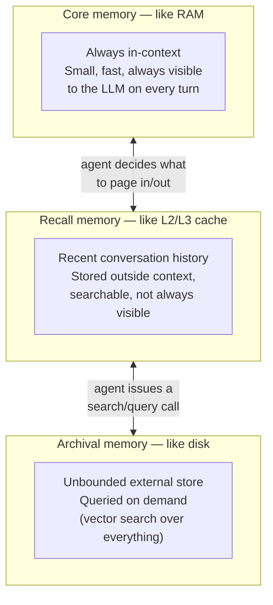
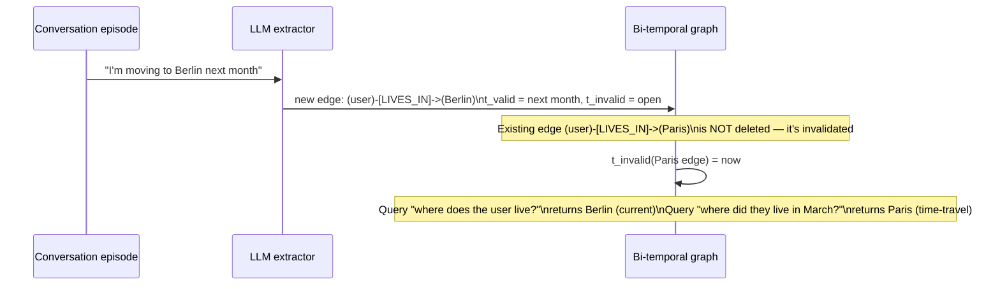
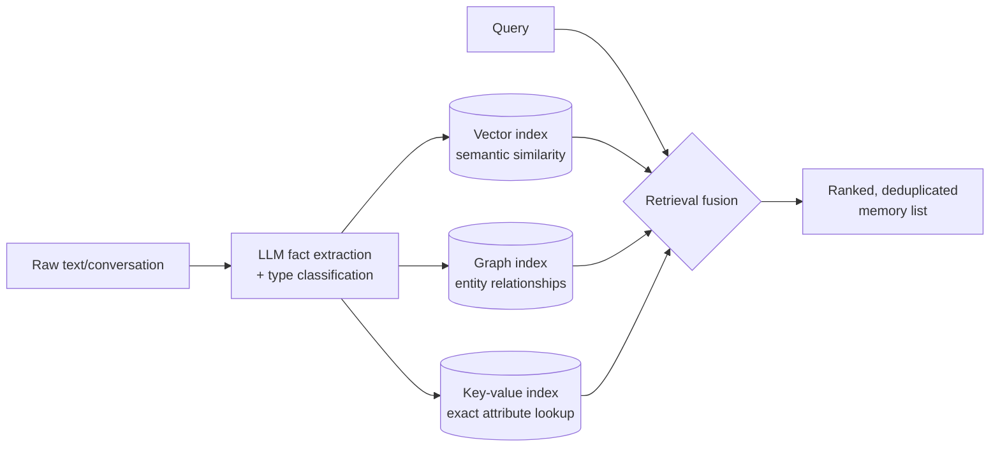

# Three Dominant Architecture Patterns (mid-2026)

Production memory systems in 2026 cluster into three architecture families. They're not mutually
exclusive — several frameworks combine two — but each optimizes for a different question.

## 1. OS-inspired tiered memory (Letta / MemGPT lineage)

The architecture is explicitly modeled on an operating system's memory hierarchy: the agent
manages its own memory the way an OS manages RAM, cache, and disk, deciding what stays
immediately accessible versus what gets paged out.

*Animated version: [`../assets/diagrams/02-os-tiered-memory.drawio`](../assets/diagrams/02-os-tiered-memory.drawio).*

The distinguishing idea: the **agent itself** calls memory-management functions (page something
out of core memory, search archival memory, edit a stored fact) as part of its own reasoning loop
— memory isn't a black box the framework manages silently, it's something the model actively
operates. This makes it a good fit for long-running, stateful services where the agent needs to
reason about *why* it's forgetting or retrieving something.

## 2. Temporal knowledge graphs (Graphiti / Zep)

Instead of flat vector records, facts are stored as edges in a graph, and — critically — every
edge carries a **bi-temporal** validity window: when the fact became true (`t_valid`) and when it
stopped being true or was invalidated (`t_invalid`), separately from when it was *ingested* into
the system.

*Animated version: [`../assets/diagrams/02-temporal-knowledge-graph.drawio`](../assets/diagrams/02-temporal-knowledge-graph.drawio)
— flattened to a flowchart (creates / invalidates / queries) since draw.io's animation applies to
edges, not UML lifelines.*

Old facts are **invalidated, not deleted** — this is what makes "what was true at time T"
queries possible, and it's the direct answer to the knowledge-update failure mode from
[`00_landscape/`](../00_landscape/README.md) (the "You are going to Singapore in July" →
"You went to Singapore in July 2026" problem OpenAI cited for ChatGPT's memory rebuild). Retrieval
combines semantic embeddings, BM25 keyword search, and graph traversal — the same three-signal
fusion idea as hybrid retrieval in [`07_rag/`](../../07_rag/) and
[`15_hippocampus_ai/00_concepts/README.md#4-hybrid-retrieval`](../../15_hippocampus_ai/00_concepts/README.md),
but traversal lets a query follow relationships ("who reports to the person I mentioned
yesterday?") that pure vector similarity can't answer. In benchmark reporting this approach shows
strong temporal-reasoning scores (see [`03_frameworks_comparison/`](../03_frameworks_comparison/README.md)) and
sub-300ms retrieval latency because ranking doesn't require an LLM call at query time.

## 3. Hybrid vector + graph + key-value (Mem0-style)

A simpler, more RAG-adjacent design: memories are extracted as short facts, embedded, and stored
across three complementary indexes so retrieval can pick the cheapest signal that answers a given
query, falling back to more expensive ones only when needed.

*Animated version: [`../assets/diagrams/02-hybrid-vector-graph-kv.drawio`](../assets/diagrams/02-hybrid-vector-graph-kv.drawio).*

This is architecturally the closest of the three to what `15_hippocampus_ai/` teaches hands-on —
HippocampAI's own retrieval stack (vector + BM25 + reranking + a real-time knowledge graph, see
[`15_hippocampus_ai/00_concepts/README.md#4`](../../15_hippocampus_ai/00_concepts/README.md)) is
this same family, independently converging on the same design. The tradeoff versus the temporal
graph approach: simpler to operate and faster to bolt onto an existing agent, at the cost of
weaker built-in support for "what changed and when" queries unless a temporal layer is added on
top (which is exactly the gap Zep's benchmark advantage in temporal reasoning comes from — see
next chapter).

## Choosing between them

| You need... | Reach for... |
|---|---|
| An agent that actively manages its own memory across a very long-running stateful task | OS-inspired tiered memory (Letta) |
| Correctness about *when* something was true, contradiction resolution, relationship traversal | Temporal knowledge graph (Zep/Graphiti) |
| Fast time-to-value bolted onto an existing agent, simple fact-level personalization | Hybrid vector+graph+KV (Mem0-style, HippocampAI) |

## Sources

- [Graphiti: Knowledge graph memory for an agentic world — Neo4j](https://neo4j.com/blog/developer/graphiti-knowledge-graph-memory/)
- [Zep: A Temporal Knowledge Graph Architecture for Agent Memory (arXiv 2501.13956)](https://arxiv.org/abs/2501.13956)
- [Graphiti: How Temporal Knowledge Graphs Give AI Voice — Callsphere](https://callsphere.ai/blog/graphiti-temporal-knowledge-graph-ai-agents-2026)
- [From Beta to Battle-Tested: Picking Between Letta, Mem0 & Zep for AI Memory — Medium](https://medium.com/asymptotic-spaghetti-integration/from-beta-to-battle-tested-picking-between-letta-mem0-zep-for-ai-memory-6850ca8703d1)
- [AI Agent Memory Architectures: From Context Windows to Persistent Knowledge — Zylos Research](https://zylos.ai/research/2026-04-05-ai-agent-memory-architectures-persistent-knowledge/)
- [Dreaming: Better memory for a more helpful ChatGPT — OpenAI](https://openai.com/index/chatgpt-memory-dreaming/)
