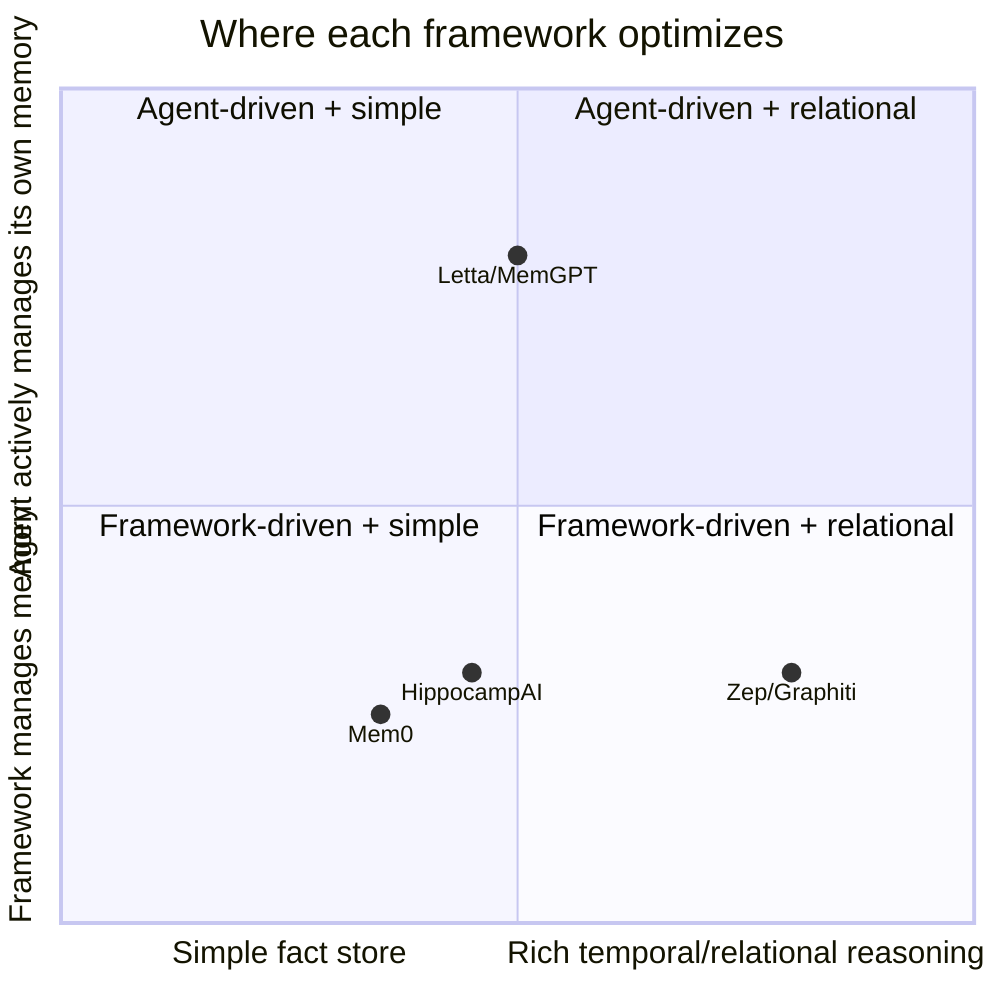
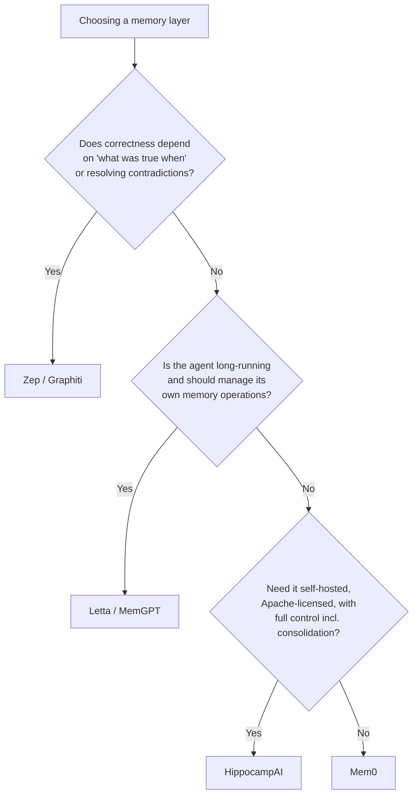

# Frameworks Compared: Mem0, Zep, Letta, and Native Provider Memory

## Open-source / self-hosted frameworks

| Framework | Architecture family (see [`02_architectures/`](../02_architectures/README.md)) | Best fit | Reported benchmark signal |
|---|---|---|---|
| **Mem0** | Hybrid vector + graph + key-value | Fast time-to-value, bolt onto an existing agent, personalization | ~47K GitHub stars; single-digit-ms write latency; OpenAI-compatible API; scored 49.0% on LongMemEval (GPT-4o) in Zep's comparative benchmark |
| **Zep / Graphiti** | Temporal knowledge graph | Systems of record needing "what was true when," contradiction resolution, relationship traversal | 63.8% on LongMemEval (GPT-4o) — the leading reported score for temporal reasoning; 94.8% vs. MemGPT's 93.4% on Deep Memory Retrieval, with ~90% lower latency than full-context baselines |
| **Letta (MemGPT lineage)** | OS-inspired tiered memory | Long-running stateful agents that actively manage their own memory | Origin of the "core/recall/archival" tiering now referenced across the field; strong on long-horizon, multi-session continuity tasks |
| **HippocampAI** (this repo's `15_hippocampus_ai/`) | Hybrid vector + graph + KV, with an explicit sleep-phase consolidation job | Self-hosted, Apache-2.0, full control including the consolidation/decay layer | See `15_hippocampus_ai/01_core_client/03_hybrid_retrieval_breakdown.py` for the live scoring breakdown this architecture produces |

**Independent testing caveat:** vendor-reported benchmark numbers disagree across sources, and the
field's own guidance in 2026 is consistent: "pick on persistence model, temporal accuracy,
latency, and compliance, not on stars" — run evals against your own workload using the standard
suites (LoCoMo, LongMemEval, BEAM) rather than trusting a single vendor's leaderboard position.

## Rule-of-thumb decision path

A commonly repeated 2026 pattern for teams shipping a chat product: **start with Mem0** (or an
equivalent hybrid store) **plus a separate task tracker, and migrate to Letta or Zep once you
outgrow it** — i.e., once temporal correctness or agent-driven memory management becomes the
actual product requirement rather than a nice-to-have.

## Native provider memory (built into the assistant, not a library you integrate)

The three frontier chat products all shipped or upgraded first-party persistent memory in 2026,
converging on the same core pattern — a background-synthesized profile rather than raw transcript
storage — while differing in mechanics:

| Provider | Mechanism (as of mid-2026) | Update cadence | Notable design point |
|---|---|---|---|
| **Anthropic (Claude)** | Extracts role/preferences/formatting into a running summary; a dedicated tool lets a user say "remember X" for an immediate update | ~every 24 hours for the auto-synthesized summary | Rolled out to all tiers (free + Pro) in March 2026; "Memory Files" (topic/project-scoped documents instead of one flat summary) announced as a forthcoming evolution |
| **OpenAI (ChatGPT)** | "Dreaming" — a background process that curates memory by referencing chat history beyond the explicit saved-memories list | Continuous background synthesis ("Dreaming V3", announced June 2026) | Explicitly designed to keep facts *current* — e.g. revising "You are going to Singapore in July" to "You went to Singapore in July 2026" once the trip passed; ~5x compute reduction made free-tier rollout viable |
| **Google (Gemini)** | "Personal context" — periodic AI-summarized profile from chat history, extending to "Personal Intelligence" pulling from Gmail/Photos/Search/YouTube | Continuous, tied to the Google Account | On by default for eligible personal accounts (18+, Keep Activity on); auto-delete window configurable (default 18 months) |

The convergence is notable: all three independently arrived at *"periodically synthesize a
compressed profile in the background, don't just store raw transcript"* — which is the
**compression** and **update** operations from
[`00_landscape/`](../00_landscape/README.md#the-five-universal-memory-operations) implemented as
core assistant infrastructure rather than something a developer has to build. This directly
validates the memory-vs-context-window distinction this chapter opened with: even the platforms
with the largest context windows in the industry chose to build a separate memory layer rather
than rely on stuffing history into context.

## Sources

- [Agent Memory Frameworks Tested: Mem0 vs Zep vs Letta — particula.tech](https://particula.tech/blog/agent-memory-frameworks-tested-mem0-zep-letta-cognee-2026)
- [AI Agent Memory 2026 — Comparing Mem0, Zep, Graphiti, Letta, LangMem — Medium](https://medium.com/@wasowski.jarek/i-compared-5-ai-agent-memory-systems-across-6-dimensions-none-wins-6a658335ed0a)
- [Best AI Agent Memory Frameworks in 2026: Compared and Ranked — Atlan](https://atlan.com/know/best-ai-agent-memory-frameworks-2026/)
- [AI Memory Benchmarks 2026: LoCoMo, LongMemEval & BEAM — Mem0](https://mem0.ai/blog/ai-memory-benchmarks-in-2026)
- [Claude Memory 2026: Complete Guide — lumichats](https://lumichats.com/blog/claude-memory-2026-complete-guide-how-to-use)
- [Anthropic plans Claude memory update with new Memory Files — TestingCatalog](https://www.testingcatalog.com/anthropic-plans-claude-memory-update-with-new-memory-files/)
- [Dreaming: Better memory for a more helpful ChatGPT — OpenAI](https://openai.com/index/chatgpt-memory-dreaming/)
- [OpenAI upgrades ChatGPT memory architecture for fresher personalized context — Let's Data Science](https://letsdatascience.com/news/openai-upgrades-chatgpt-memory-architecture-for-fresher-pers-b26b51d5)
- [Gemini gets personal as Google rolls out a big memory upgrade — Android Authority](https://www.androidauthority.com/google-gemini-personal-intelligence-rollout-3632287/)
- [Personal context — Google](https://gemini.google.com/personal-context)
