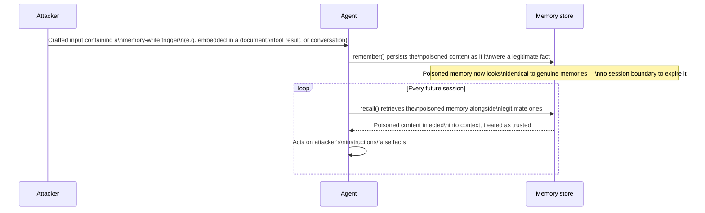
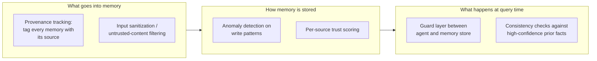
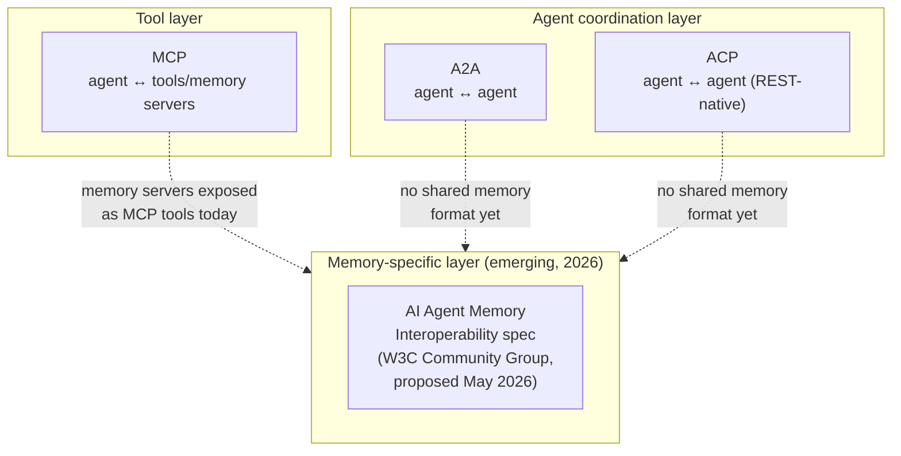

# Memory Security and Interoperability

Persistent memory doesn't just add a capability — it adds a persistent attack surface. And once
agents from different vendors need to share or hand off memory, "how do I query my own memory
store" stopped being enough; 2026 saw the first serious push toward interoperability standards.

## Memory poisoning: the risk that didn't exist before persistent memory

**Prompt injection** is session-scoped: malicious instructions in the current input make the model
misbehave for that turn/session, and the effect ends when the session ends. **Memory poisoning**
is the persistent version: an attacker gets malicious content written into the agent's long-term
memory store, where it silently corrupts every *future* session that retrieves it — "poison once,
exploit forever."

*Animated version: [`../assets/diagrams/04-memory-poisoning-attack.drawio`](../assets/diagrams/04-memory-poisoning-attack.drawio)
— flattened to a flowchart with an explicit "next session" loop-back edge.*

Reported attack success rates against LLM-agent implementations in 2026 research range from ~80%
to as high as 99.8% under specific conditions; one technique (AgentPoison) reported over 80%
success at under 0.1% poison rate in RAG-based agents, with no model retraining required — meaning
the attack targets the memory *store*, not the model's weights. The security community formalized
this as **OWASP ASI06 — Memory and Context Poisoning** in the 2026 Agentic AI Top 10.

### Defense layers

Research converges on a layered defense across the same three stages the write/read path already
has:

*Animated version: [`../assets/diagrams/04-defense-layers.drawio`](../assets/diagrams/04-defense-layers.drawio).*

**OWASP Agent Memory Guard**, released mid-2026, is the OWASP-sanctioned open-source reference
implementation for ASI06 — a runtime guard layer that sits between an agent and its memory store,
implementing exactly this "runtime" stage. Practical takeaway for anything built in this repo:
`15_hippocampus_ai/00_concepts/README.md#2-memory-types` already tags every memory with a `type`
and `importance` at write time — the provenance-tracking defense above is the same idea taken
further (tag *where the content came from*, not just what kind of fact it is), and is the missing
piece if you were to put a HippocampAI-style memory store in front of untrusted input (e.g.
memories extracted from a document a user uploaded, rather than from the user's own direct
statements).

## Interoperability: memory stopped being framework-private

Three protocols dominate 2026 production conversations for agent interoperability generally:

| Protocol | Governs | Owner |
|---|---|---|
| **MCP** (Model Context Protocol) | Agent-to-tool connectivity — how an LLM calls tools, including retrieval/memory tools | Anthropic-originated, now under Linux Foundation oversight |
| **A2A** (Agent-to-Agent) | Inter-agent coordination and task handoff | Google-originated, now under Linux Foundation oversight |
| **ACP** (Agent Communication Protocol) | REST-native agent messaging | IBM/AGNTCY, now under Linux Foundation oversight |

*Animated version: [`../assets/diagrams/04-interop-protocol-stack.drawio`](../assets/diagrams/04-interop-protocol-stack.drawio).*

Important nuance from Stanford's 2026 review of production agent limitations: MCP solves
*tool connectivity*, one of four named constraints on production agents (memory, reliability,
interoperability, efficiency) — it is not, by itself, a memory *portability* standard. Today,
memory servers (e.g. "OpenMemory") expose themselves as MCP-compatible tools so any MCP client
(Claude Desktop, Cursor, VS Code, etc. — see [`10_mcp/`](../../10_mcp/) for the protocol
fundamentals) can call them, but the underlying memory *format* still isn't portable between
vendors. That gap is what the **AI Agent Memory Interoperability Community Group** (proposed to
the W3C in May 2026) exists to close — a protocol-level spec for memory that's portable across
vendors, models, and frameworks, rather than every framework inventing its own schema. As of
mid-2026 this is early-stage; expect it to still be forming rather than a settled standard.

## Sources

- [AI agent memory poisoning: how attackers corrupt Long-Term agent behavior — MintMCP](https://www.mintmcp.com/blog/ai-agent-memory-poisoning)
- [From Untrusted Input to Trusted Memory: A Systematic Study of Memory Poisoning Attacks (arXiv 2606.04329)](https://arxiv.org/pdf/2606.04329)
- [AI Agent Memory Poisoning: Defense Guide 2026 — BeyondScale](https://beyondscale.tech/blog/ai-agent-memory-poisoning-defense-guide)
- [AI Memory Security: Best Practices and Implementation — Mem0](https://mem0.ai/blog/ai-memory-security-best-practices)
- [Memory poisoning in AI agents: exploits that wait — Christian Schneider](https://christian-schneider.net/blog/persistent-memory-poisoning-in-ai-agents/)
- [Agent Interoperability Protocols 2026: MCP, A2A, ACP and the Path to Convergence — Zylos Research](https://zylos.ai/research/2026-03-26-agent-interoperability-protocols-mcp-a2a-acp-convergence/)
- [Memory in AI: MCP, A2A & Agent Context Protocols — Orca Security](https://orca.security/resources/blog/bringing-memory-to-ai-mcp-a2a-agent-context-protocols/)
- [AI Agent Memory Interoperability Community Group — W3C](https://www.w3.org/community/ai-agent-memory-interop/)
- [MCP for RAG and Agent Memory: How They Work Together — getknit.dev](https://www.getknit.dev/blog/powering-rag-and-agent-memory-with-mcp)
